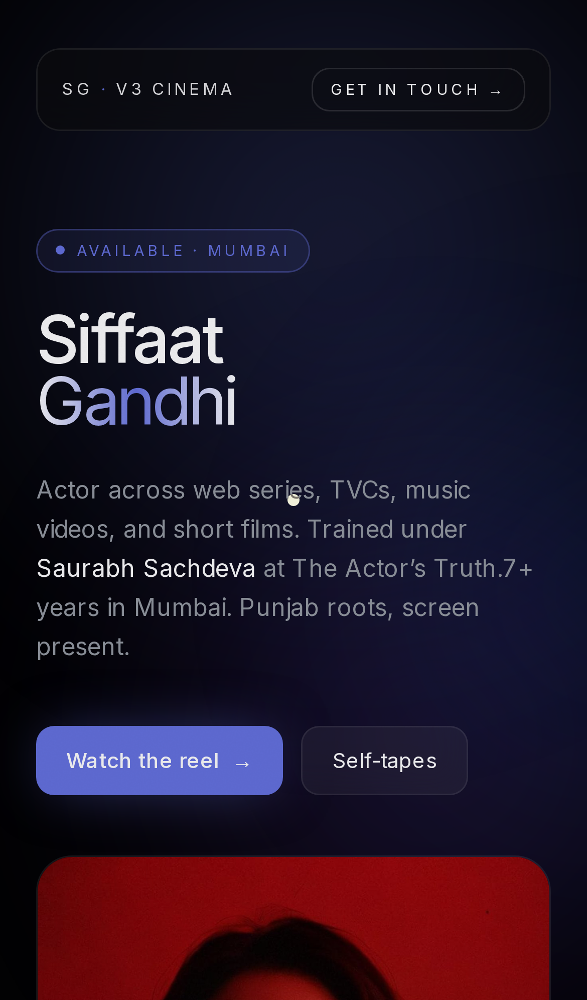
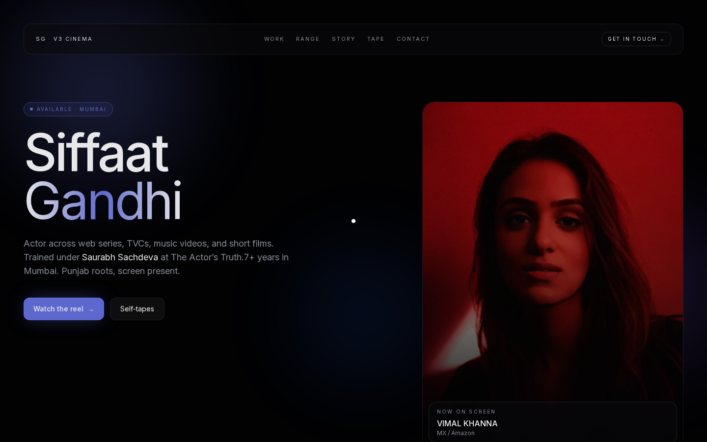

<div align="center">

# SIFFAAT SPOTLIGHT — v3 · MODERN DARK CINEMA

### A SPOTLIGHT · Nº 03 · MUMBAI · MMXXVI

*OTT-grade dark cinema edition of [siffaatgandhi.online](https://siffaatgandhi.online/). Deep blacks, indigo glow, glassmorphism, ambient blur blobs.*

[](https://github.com/Piyushmishra29/siffat-spotlight/tree/v3-cinema)
[](http://localhost:3000/v3)
[](https://uupm.cc)

</div>

---

## WHAT THIS IS

Streaming-platform-grade premium dark theme. Picture how a talent page on **Apple TV+, Hotstar, or A24's site** would feel — that's the target. Quiet, atmospheric, glass cards floating over slow-moving coloured light.

Design system generated via [UI/UX Pro Max v2.5](https://github.com/nextlevelbuilder/ui-ux-pro-max-skill) on `2026-05-13`.

> *"Cinematic, technical, precision, clean, premium. High-end utility."*

---

## PREVIEW

<table>
  <tr>
    <td align="center" width="320">
      
      <br/><sub><b>Mobile · Glass nav + portrait card</b></sub>
    </td>
    <td align="center" width="320">
      
      <br/><sub><b>Desktop · Hero with ambient blobs</b></sub>
    </td>
  </tr>
</table>

Full-page mobile capture: [`screenshots/v3/mobile-full.png`](screenshots/v3/mobile-full.png)
Full-page desktop capture: [`screenshots/v3/desktop-full.png`](screenshots/v3/desktop-full.png)

---

## DESIGN SYSTEM

| Token | Value | Use |
|---|---|---|
| `v3deep` | `#020203` | Page ground · darkest layer |
| `v3base` | `#050506` | Surface base |
| `v3elev` | `#0A0A0C` | Elevated card surfaces |
| `v3surf` | `rgba(255,255,255,0.05)` | Glass/frosted surfaces |
| `v3fg` | `#EDEDEF` | Primary text |
| `v3mute` | `#8A8F98` | Secondary text |
| `v3accent` | `#5E6AD2` | Indigo accent · primary CTA |
| `v3glow` | `rgba(94,106,210,0.25)` | Accent glow halos |
| `v3border` | `rgba(255,255,255,0.08)` | Hairline borders |

**Pattern:** Portfolio Grid with hero portrait card.
**Style:** Modern Dark (Cinema Mobile) — soft 16-24px radius, glassmorphism (backdrop-blur 16-20px), hairline borders, atmospheric. Never pure `#000000` (OLED smear).
**Typography:** **Inter** — `font-light` for display headlines, `font-medium` for emphasis, `font-regular` for body. Bezier easing `cubic-bezier(0.16, 1, 0.3, 1)`.

### Key effects
- **Animated ambient blobs** — 3 radial-gradient blurs (indigo · violet · blue) on a fixed background layer, slow oscillation via CSS keyframes
- **Glassmorphism** — sticky top nav + bottom portrait info strip with `backdrop-filter: blur(16-20px)`
- **Indigo glow halos** on primary CTA + hovered tape tiles via `box-shadow: 0 0 40px -10px rgba(94,106,210,0.5)`
- **Bezier easing** Apple-style — `cubic-bezier(0.16, 1, 0.3, 1)`
- **Hairline borders** — never solid, always `rgba(255,255,255,0.08)`

### Anti-patterns (avoid)
- Pure `#000000` backgrounds (OLED smear, blocks gradient depth)
- Sharp 0px radii — this is the opposite of v2 brutalism
- Strong borders, hard color transitions

---

## SECTIONS

| Nº | Section | What it does |
|----|---------|--------------|
| — | Sticky glass nav | `SG · v3 CINEMA` · section nav · "Get in touch" CTA — backdrop-blur 20px |
| Hero | 2-col grid | Status pill ("Available · Mumbai") · gradient name "Gandhi" · primary CTA + secondary CTA · floating portrait card with glass info strip ("Now on screen") |
| — | Stat row | 4 glass cards: TVCs · Web series · Music videos · Self-tapes |
| 01 | `Work` | 18-tile portfolio grid (4:5 cards) — categorised by tag chip (SERIES · MUSIC · FILM · TVC), indigo glow on hover |
| 02 | `Range` | 5-frame portrait grid · soft radius · subtle scale-up on hover |
| 03 | `Story` | 2-col: drop-cap letter + glass spec sheet (hometown · languages · skills · height) |
| 04 | `Tape` | 6 self-tape tiles (16:9 cards) · indigo glow on hover · cinematic posters |
| 05 | `Contact` | Gradient closer text · 3 contact cards on glass · fin with back-to-v1 |

---

## STACK

| Layer | What |
|---|---|
| Framework | Next.js 14 app router · static export |
| Language | TypeScript |
| Styles | Tailwind CSS + custom v3 token extension · arbitrary `rgba()` for hairlines |
| Fonts | Inter (Google Fonts) — weights 300, 400, 500, 600, 700 |
| Images | `next/image` with `unoptimized` flag for YouTube thumbnails |
| Motion | Pure CSS keyframes (animated blobs) · no JS scroll listeners (lightweight) |
| Host | Hostinger static (when merged) |

Build size: **`/v3` route = 175 B route-specific** (92.8 kB total first-load).

---

## RUN LOCALLY

```bash
git clone git@github.com:Piyushmishra29/siffat-spotlight.git
cd siffat-spotlight
git checkout v3-cinema
npm install
npm run dev      # http://localhost:3000/v3
```

---

## GOOD FOR / NOT FOR

**Good for:** Premium TVC pitches (auto, jewellery, luxury). OTT-platform casting. Anyone selling a high-end emotional palette. Audiences shopping at the Hotstar / Apple TV+ tier.

**Not for:** Indie / underground positioning. Audiences with weak GPUs (blur effects need acceleration). Anything that needs to feel hand-made or warm — this is intentionally cool and machined.

---

## MERGE INTO MAIN

```bash
git checkout main
git merge v3-cinema
git push origin main
```

Hostinger auto-deploys `main` to [siffaatgandhi.online](https://siffaatgandhi.online/) within a minute. `/v3` will be live alongside the current home page.

---

<div align="center">

### v3 — END.

*One of five design directions explored for the 2026 spotlight.*
*See also: [v2 brutalist](https://github.com/Piyushmishra29/siffat-spotlight/tree/v2-brutalist) · [v4 vintage](https://github.com/Piyushmishra29/siffat-spotlight/tree/v4-vintage) · [v5 couture](https://github.com/Piyushmishra29/siffat-spotlight/tree/v5-couture) · [v6 exaggerated](https://github.com/Piyushmishra29/siffat-spotlight/tree/v6-exaggerated)*

</div>
