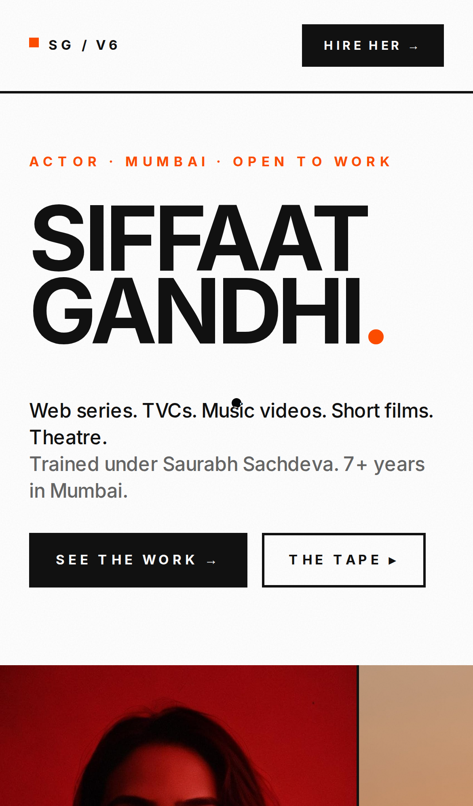
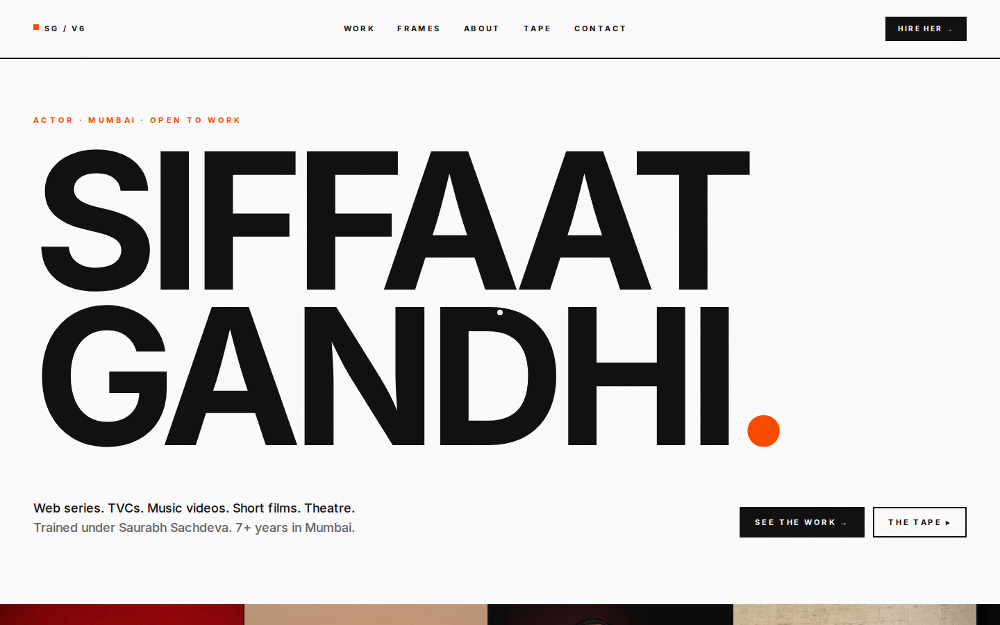

<div align="center">

# SIFFAAT SPOTLIGHT — v6 · EXAGGERATED MINIMALISM

### A SPOTLIGHT · Nº 06 · MUMBAI · MMXXVI

*Agency-portfolio edition of [siffaatgandhi.online](https://siffaatgandhi.online/). White ground, Inter Black at 19vw, hard 2px borders, one vivid orange `#FF4D00` accent.*

[](https://github.com/Piyushmishra29/siffat-spotlight/tree/v6-exaggerated)
[](http://localhost:3000/v6)
[](https://uupm.cc)

</div>

---

## WHAT THIS IS

The **agency-portfolio** version. Headline-as-art at viewport scale. White paper, ink-black type, one punctuation-only orange accent. Pentagram / Off-White / Mother Design DNA. Built for casting directors who treat the actor's site like a creative agency reel.

Design system generated via [UI/UX Pro Max v2.5](https://github.com/nextlevelbuilder/ui-ux-pro-max-skill) on `2026-05-13`.

> *"Bold minimalism, oversized typography, high contrast, negative space, loud minimal, statement design."*

---

## PREVIEW

<table>
  <tr>
    <td align="center" width="320">
      
      <br/><sub><b>Mobile · Hero lockup</b></sub>
    </td>
    <td align="center" width="320">
      
      <br/><sub><b>Desktop · 19vw display caps + edge-strip</b></sub>
    </td>
  </tr>
</table>

Full-page mobile capture: [`screenshots/v6/mobile-full.png`](screenshots/v6/mobile-full.png)
Full-page desktop capture: [`screenshots/v6/desktop-full.png`](screenshots/v6/desktop-full.png)

---

## DESIGN SYSTEM

| Token | Value | Use |
|---|---|---|
| `v6bg` | `#FFFFFF` | Page ground · pure paper |
| `v6ink` | `#111111` | Type · borders · everything structural |
| `v6mute` | `#666666` | Metadata captions only |
| `v6line` | `#E2E2E2` | (Reserved — currently unused; v6 uses ink for all borders) |
| `v6pop` | `#FF4D00` | The one accent — punctuation periods, dots, CTA fills, eyebrow labels |
| `v6popDim` | `#FFE9DD` | Peach-tinted full-section ground for The Tape |

**Pattern:** Bold portfolio with hero overflow + section grounds.
**Style:** Exaggerated Minimalism — oversized headline-as-art (`SIFFAAT GANDHI.` set at 18-19vw), single vibrant accent used only as punctuation, hard 2px ink borders, zero radius.
**Typography:** **Inter Black (900 weight)** for display caps · **Inter Bold (700)** for labels · **Inter Medium (500)** for body. All uppercase for display. The whole system uses a single typeface family — Inter — but lets weight do all the hierarchy work.

### Key effects
- **19vw display caps** — the name lockup occupies most of the hero (`clamp(4rem, 19vw, 22rem)`)
- **Orange punctuation** — periods, dots, the comma in "WORK, UP CLOSE" — the accent never fills a whole element, just one mark
- **Hard 2px borders** on every interactive surface — contracts, work cards, contact cards
- **Section ground shifts** — white → inverted ink (FRAMES) → white → peach (TAPE) → white. Hard rhythm.
- **Edge-to-edge portrait strip** — full-bleed snap-scroll under the hero, no padding
- **Contract-bar nav** at the top — 2px borders, orange status dot
- **Hover floods** — work tiles + tape rows flood orange on hover (label background)

### Anti-patterns (avoid)
- Multiple accent colours (only `v6pop`)
- Soft radii — must be 0
- Borders thinner than 2px
- Body text at small sizes — base 16px minimum

---

## SECTIONS

| Nº | Section | What it does |
|----|---------|--------------|
| Nav | Contract bar | Orange status dot · `SG / v6` · section nav · "HIRE HER →" CTA |
| Hero | Cover | `ACTOR · MUMBAI · OPEN TO WORK` eyebrow · 19vw `SIFFAAT GANDHI.` (orange period) · 2-CTA row |
| — | Edge strip | Full-bleed horizontal snap-scroll · 6 portraits · `Nº01–06` labels |
| — | Stats | 4-cell bordered grid: TVCs · Series · MV · Tapes |
| 01 | Work | 18 work cards · 2px border, hard tag chip, orange period in "WORK, UP CLOSE." |
| 02 | Frames | **Inverted ink section** (black ground) · 6-up portrait wall · orange section number |
| 03 | About | "HONEST WORK. NOTHING ELSE." · 8-row dossier spec card |
| 04 | Tape | **Peach-tinted section** · 6 tape rows · flood-fill orange on hover |
| 05 | Contact | 18vw `HIRE HER.` (HER in orange) · 3 contact cards that flood orange on hover · fin with back-to-v1 |

---

## STACK

| Layer | What |
|---|---|
| Framework | Next.js 14 app router · static export |
| Language | TypeScript |
| Styles | Tailwind CSS + custom v6 token extension |
| Fonts | Inter (Google Fonts) — weights 400, 500, 700, 900 (single family) |
| Images | `next/image` with `unoptimized` for YouTube thumbnails |
| Motion | Minimal — hover transforms only · no scroll-driven motion · no animation lib |
| Host | Hostinger static (when merged) |

Build size: **`/v6` route = 176 B route-specific** (92.8 kB total first-load).

---

## RUN LOCALLY

```bash
git clone git@github.com:Piyushmishra29/siffat-spotlight.git
cd siffat-spotlight
git checkout v6-exaggerated
npm install
npm run dev      # http://localhost:3000/v6
```

---

## GOOD FOR / NOT FOR

**Good for:** Pitching to fashion directors, premium TVC casting, art directors at agencies. Anyone primed on Pentagram, Mother, Bureau Mirko Borsche. Decisions made in seconds (the hero alone closes the loop).

**Not for:** Quiet/intimate emotional positioning. Indie cinema (the agency-deck energy fights the auteur frame). Anything that wants warmth — this is intentionally hard-edged.

---

## ONE-COLOUR DISCIPLINE

The accent rule is strict:

- Orange `#FF4D00` is allowed **only** as: punctuation periods/commas, status dots, hover fills, eyebrow text on white grounds
- Orange is **never** a block of background outside of hover state, never the colour of body text, never the colour of a primary heading
- The peach `#FFE9DD` is a single-section ground (Tape only) — it does not appear elsewhere

When in doubt: would Pentagram do it? If yes, ship. If no, kill it.

---

## MERGE INTO MAIN

```bash
git checkout main
git merge v6-exaggerated
git push origin main
```

Hostinger auto-deploys `main` to [siffaatgandhi.online](https://siffaatgandhi.online/) within a minute. `/v6` will be live alongside the current home page.

---

<div align="center">

### v6 — END.

*One of five design directions explored for the 2026 spotlight.*
*See also: [v2 brutalist](https://github.com/Piyushmishra29/siffat-spotlight/tree/v2-brutalist) · [v3 cinema](https://github.com/Piyushmishra29/siffat-spotlight/tree/v3-cinema) · [v4 vintage](https://github.com/Piyushmishra29/siffat-spotlight/tree/v4-vintage) · [v5 couture](https://github.com/Piyushmishra29/siffat-spotlight/tree/v5-couture)*

</div>
