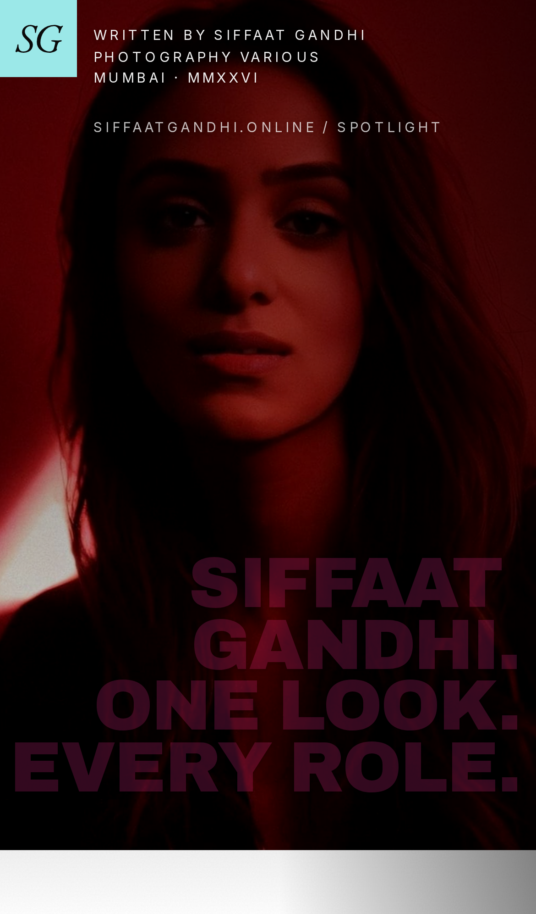
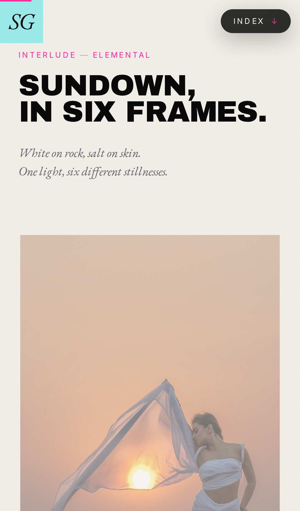
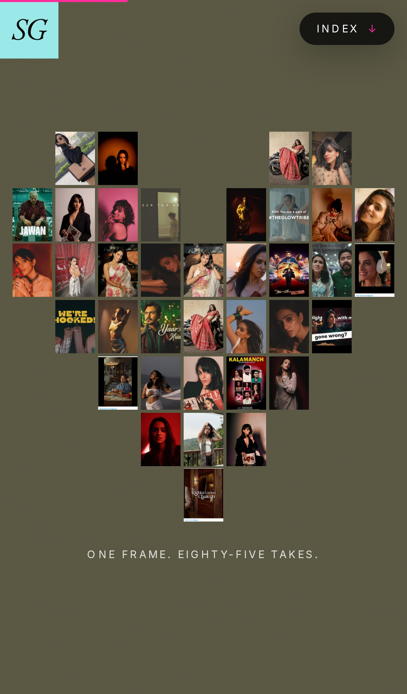
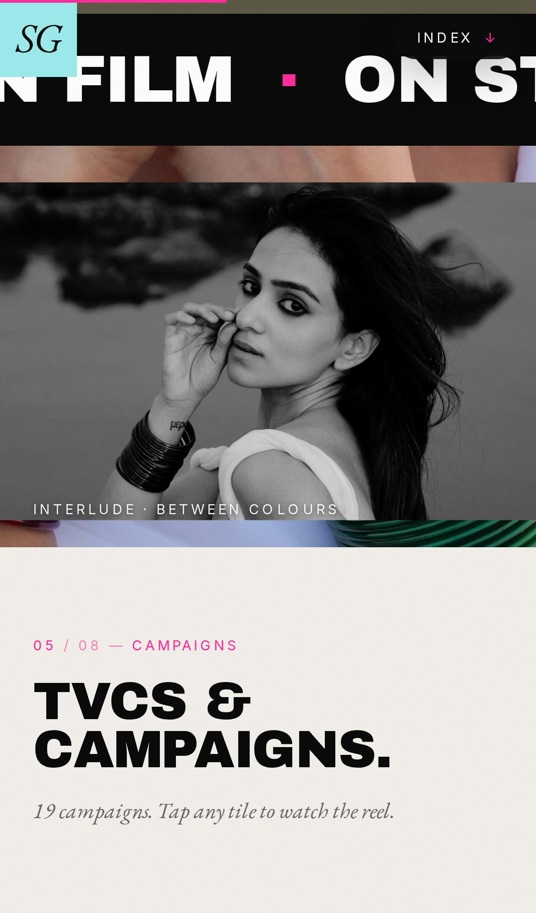
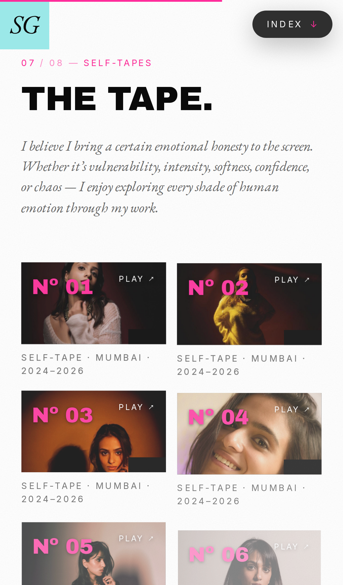
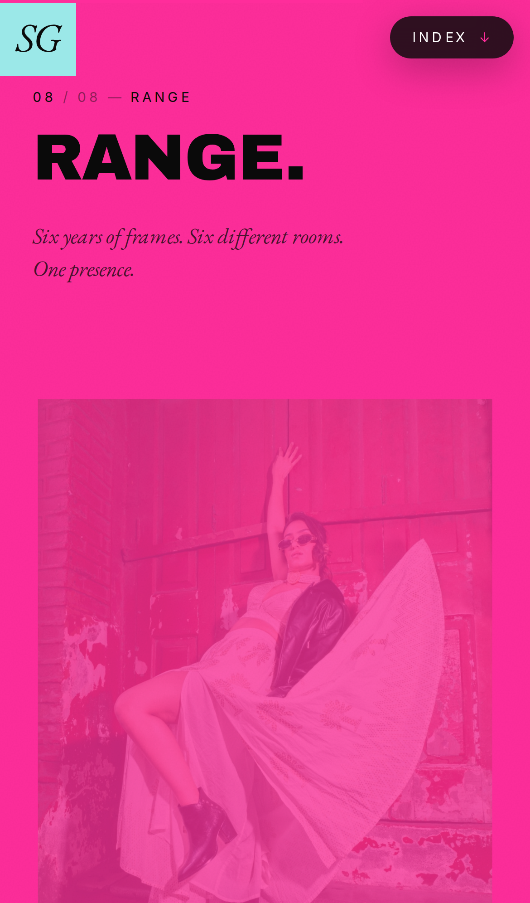
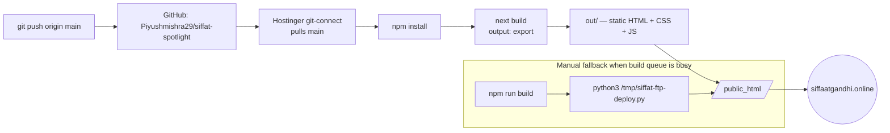
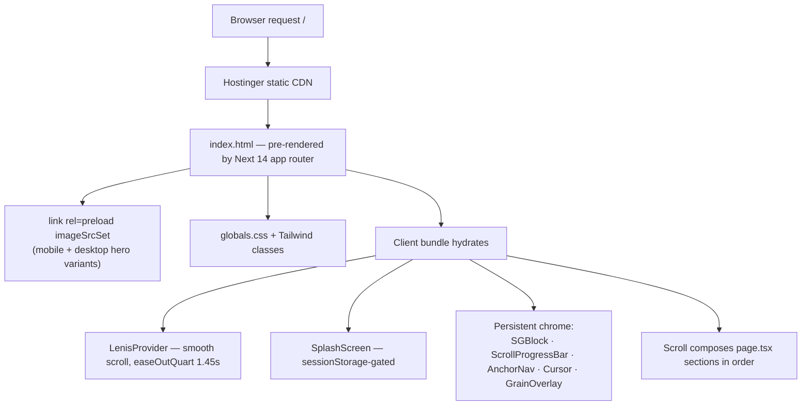
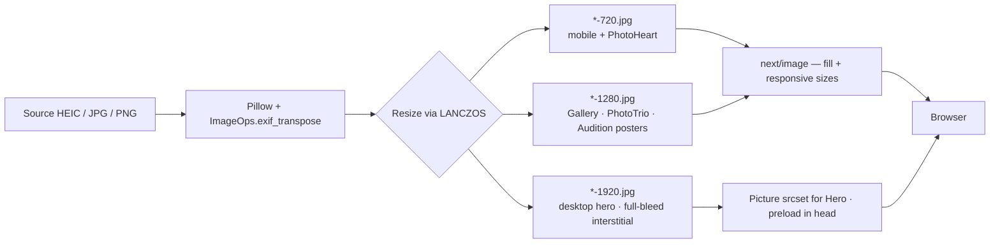
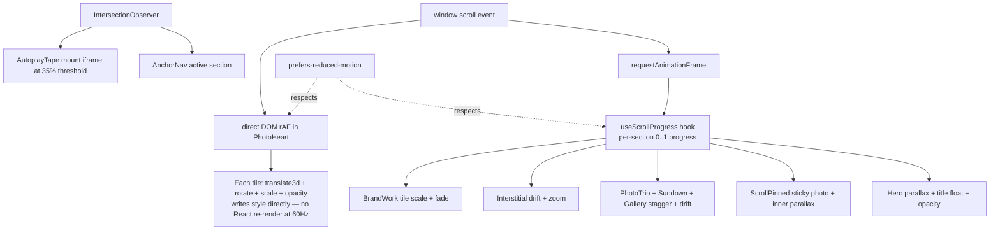

<div align="center">

# SIFFAAT GANDHI. ONE LOOK. EVERY ROLE.

### A SPOTLIGHT · Nº 01 · MUMBAI · MMXXVI

*A long-scroll editorial site for actor **Siffaat Gandhi**.*
*Built like a magazine. Lives on the web. Pitched to casting agents.*

[](https://nextjs.org/)
[](https://www.typescriptlang.org/)
[](https://tailwindcss.com/)
[](https://siffaatgandhi.online/)

</div>

---

## INTRO.

Source for [**siffaatgandhi.online**](https://siffaatgandhi.online/) — a single-page, scroll-driven, magazine-style spotlight for **Siffaat Gandhi**, a Mumbai-based actor working across web series, TVCs, music videos, and short films.

The reference is i-D Magazine's *Spotlight* series: editorial typography, full-bleed photography, hand-drawn stickers, bold colour blocks, scroll-driven motion, and the kind of pacing you only get from a print designer.

> *"Presence in every frame. Versatility in every look."*

The hero pitches casting agents in three lines: **SIFFAAT GANDHI · ONE LOOK · EVERY ROLE.**

---

## ON MOBILE.

<table>
  <tr>
    <td align="center" width="200"><br/><sub>Hero</sub></td>
    <td align="center" width="200"><br/><sub>Sundown · 01.5</sub></td>
    <td align="center" width="200"><br/><sub>Photo heart</sub></td>
  </tr>
  <tr>
    <td align="center" width="200"><br/><sub>Interlude</sub></td>
    <td align="center" width="200"><br/><sub>Self-tapes · 07</sub></td>
    <td align="center" width="200"><br/><sub>Range · 08</sub></td>
  </tr>
</table>

---

## THE SCROLL.

A single-page narrative split into chapters. Each scene is its own component, composed in `app/page.tsx`. Numbered eyebrows (`01 / 08 — STORY`) anchor the magazine rhythm.

| Nº | Section | Component | Treatment |
|----|---------|-----------|-----------|
| — | Cover | `Hero` | Full-bleed red-door portrait, top-half scrim, three-line pink display caps with word-by-word kinetic reveal on mount, parallax on scroll |
| Quote | "Presence in every frame." | `PinkBlockQuote` | Full-bleed pink, EB Garamond italic, scale-on-enter |
| 01 | Story | `Story` via `ScrollPinned` | Sticky photo column right, narrative text left, inner parallax through frame |
| — | Sundown | `Sundown` | Cream interlude · 6-tile coastal sequence (white-saree sunset shoot), captioned I–VI, per-tile drift |
| — | Photo trio | `PhotoTrio` | Olive band, three frames, inline figcaptions, staggered entry |
| Quote | "It's not performance — it's presence." | `PinkBlockQuote` | Tight density |
| 02 | Series | `OnScreen` | 2-up web series cards, hover pink border slide |
| — | Heart of photos | `PhotoHeart` | 76-tile heart (13×11 desktop, 9×7 mobile) of every photo, assembles on scroll inside a sticky frame · 2D-adjacency placement so no frame repeats next to itself |
| 03 | Motion | `MusicVideos` | LiteYouTube tiles, stagger-rise |
| 04 | Training | `OliveSection` | Saurabh Sachdeva / Antar Angan callout on olive |
| — | Marquee | `Marquee` | Horizontal scroll of display caps · ink strip · pink accents |
| — | Interlude | `Interstitial` | Full-bleed bangle-band composite spread, captioned BETWEEN COLOURS, drift parallax |
| 05 | Campaigns | `BrandWork` | Wordmark band + editorial 1-big-3-stacked stills grid on cream |
| 06 | Produced | `ShortFilms` | 2-up film cards, pink border slide on hover |
| — | Pinned image | `PinnedImage` | Full-bleed sticky photo with scale + inner parallax (priority-loaded) — rose & rotary phone vignette |
| 07 | Self-tapes | `AuditionReels` + `AutoplayTape` | 6 reels with cinematic studio-portrait posters, autoplay muted+looped when in view, click → YouTube |
| 08 | Range | `Gallery` | 12-tile editorial grid on pink, varied col-spans, inner parallax drift per tile |
| — | Stickers | `StickersScatter` | Polaroid anchor + clustered hand-drawn SVG stickers with wiggle |
| — | Contact | `Contact` | Olive bg, paper text, big pink "LET'S WORK" |
| — | Fin | `Fin` | Black slab with cyan SG hang-off, scroll-to-top |
| — | Footer | `Footer` | Tracked caps signature + tiny "built with ♥ by π" |

Persistent chrome (mounted in `app/layout.tsx`):

- **`SGBlock`** — sticky cyan-on-pink brand badge, desktop two-stack + mobile 56×56 cyan square
- **`ScrollProgressBar`** — 2 px pink line tracking scroll position
- **`AnchorNav`** — pill nav appears after scroll > 100vh, smooth-scroll to each section, active state via IntersectionObserver
- **`LenisProvider`** — Lenis smooth scroll, easeOutQuart, 1.45s duration
- **`Cursor`** — paper dot with `mix-blend-mode: difference`, expands + shows label on `data-cursor-label` tiles
- **`GrainOverlay`** — SVG turbulence noise, 8-step keyframe shift, multiply blend at 7%
- **`SplashScreen`** — first-paint SG badge entry, sessionStorage-gated so it never repeats

---

## STACK.

| Layer | What |
|---|---|
| Framework | **Next.js 14** (app router, static export) |
| Language | **TypeScript** |
| Styles | **Tailwind CSS** + custom utilities |
| Smooth scroll | **Lenis** |
| Display type | **Archivo Black** (Google Fonts) |
| Body type | **EB Garamond** (Google Fonts) |
| Labels / mono | **Inter** (Google Fonts) |
| Images | `next/image` + responsive `<picture>` srcset for hero |
| Motion | CSS keyframes + custom `useScrollProgress` hook, no animation lib |
| Embeds | `LiteYouTube` (click-to-play) + `AutoplayTape` (in-view muted loop) |
| Host | **Hostinger** — git-connected auto-deploy on push to `main` |
| Output | `out/` — pure HTML/CSS/JS, no server |

No analytics, no tracker, no JS animation framework.

### Build & deploy pipeline.



### Render pipeline (cold-load).



### Media pipeline.



### Scroll-motion architecture.



---

## PALETTE.

```
#FFFFFF   Paper      pure white ground
#F4F1EC   Cream      BrandWork section, warm break
#0A0A0A   Ink        body type, base black, marquee strip
#FF2D9B   Pink       the spotlight colour
#FFD9EC   Pink Soft  hover wash on cards
#5C5A45   Olive      Training, Photo Trio, Photo Heart, Contact
#666666   Warm Grey  captions, supporting type
#9BE8E8   Cyan       SG badge, Fin SG hang-off
```

Colour rhythm: paper / pink / olive / cream alternation across the scroll prevents any stretch of identical bg, then ink moments (Marquee, PinnedImage, Fin slab) punctuate.

---

## TYPOGRAPHY.

- **Display caps** — Archivo Black, `clamp(2.4rem, 7vw, 6rem)` for section h2s, `clamp(3.25rem, 11vw, 9.5rem)` for the hero h1. Kerned tight via `tracking-tight2 (-0.02em)`.
- **Body** — EB Garamond, italic for dek / quote, regular for long-form. Drop cap in pink on the Story opener.
- **Labels** — Inter at 10–11 px, uppercase, `tracking-widest (0.18em)`. The chapter eyebrow component (`ChapterEyebrow`) standardises the slug format `NN / TT — LABEL`.

---

## MOTION.

Everything scroll-driven; nothing time-driven except the splash + marquee + grain.

| Hook | Used by |
|---|---|
| `useScrollProgress` | Hero parallax + title float, PhotoTrio tile stagger + inner parallax, PhotoHeart assembly, ScrollPinned sticky photo, MusicVideos stagger, BrandWork wordmark fade + tile scale, ShortFilms cards, AuditionReels tiles, Gallery per-tile drift, StickersScatter per-sticker drift, PinkBlockQuote scale, OliveSection / Contact / Fin rise |
| `useFadeIn` | Legacy, retained for one-shot fade utilities |
| `IntersectionObserver` (direct) | `AnchorNav` active-section, `AutoplayTape` in-view trigger |

Shared motion math lives in `lib/motion.ts` (`staggerRise`, `easeOutCubic`, `tileLocal`).

All hooks respect `prefers-reduced-motion: reduce`.

---

## SEO.

Targets four casting-agent audiences: Mumbai casting directors, OTT (Hindi web series), TVC / brand campaigns, international festival circuit.

- `app/layout.tsx` — keyword-rich metadata, OG profile-type, Twitter large-image card, canonical, robots index+follow
- `app/robots.ts` — Next 14 metadata route → `/robots.txt`
- `app/sitemap.ts` → `/sitemap.xml`
- JSON-LD `Person` schema with `jobTitle`, `image`, `sameAs` (Instagram), `address`, `alumniOf` (Saurabh Sachdeva training), `memberOf` (Antar Angan), `knowsLanguage`
- `public/og-cover.jpg` — 1200×630 share card with name + tagline + domain on a black panel, portrait on the right
- Section IDs (`#story`, `#series`, `#motion`, `#training`, `#campaigns`, `#produced`, `#tape`, `#range`, `#contact`) enable deep-linking and the AnchorNav highlight

---

## PERFORMANCE.

- Hero ships responsive `<picture>` srcset (720w / 1280w / 1920w) instead of the 6.4 MB source. Preloaded in `<head>` via `<link rel="preload" as="image" imageSrcSet="...">` so LCP fires fast.
- PinnedImage uses `priority` to skip lazy-load and avoid the black-hole moment.
- AutoplayTape iframes mount only when the tile crosses 35 % intersection ratio; pauses out of view.
- All scroll-driven transforms are `translate3d` + `scale` — no layout thrash.
- Static export → CDN-friendly, no Node runtime.

---

## STRUCTURE.

```
siffat-spotlight/
├── app/
│   ├── page.tsx                 # Composes the scroll
│   ├── layout.tsx               # Fonts, metadata, JSON-LD, persistent chrome
│   ├── globals.css              # Tailwind + utilities (grain, scrim, marquee, kinetic word, splash, editorial treatment)
│   ├── robots.ts                # /robots.txt
│   ├── sitemap.ts               # /sitemap.xml
│   └── components/
│       ├── Hero.tsx             # Cover + kinetic title
│       ├── PinkBlockQuote.tsx   # Reusable pink quote block
│       ├── Story.tsx            # Bio with drop cap (wrapped in ScrollPinned)
│       ├── ScrollPinned.tsx     # Sticky photo + parallax text pattern
│       ├── Sundown.tsx          # Coastal 6-frame interlude (white-saree sunset shoot)
│       ├── Interstitial.tsx     # Full-bleed wide-image divider with drift parallax
│       ├── PhotoTrio.tsx        # Three-photo olive band
│       ├── PhotoHeart.tsx       # 76-tile (mobile 38-tile) scroll-assembled heart · 2D-adjacency placement
│       ├── OnScreen.tsx         # Web series cards
│       ├── MusicVideos.tsx      # Lite-YouTube tiles
│       ├── OliveSection.tsx     # Olive callout (training)
│       ├── PinnedImage.tsx      # Full-bleed sticky image break
│       ├── BrandWork.tsx        # TVCs wordmarks + editorial grid
│       ├── ShortFilms.tsx       # Produced shorts cards
│       ├── AuditionReels.tsx    # Tape grid
│       ├── AutoplayTape.tsx     # In-view muted-loop YouTube iframe
│       ├── Gallery.tsx          # Editorial 12-col grid
│       ├── StickersScatter.tsx  # Polaroid + clustered stickers
│       ├── Contact.tsx          # Let's work
│       ├── Fin.tsx              # Closing slab
│       ├── Footer.tsx           # Tracked caps + π signature
│       ├── ChapterEyebrow.tsx   # NN / TT — LABEL slug
│       ├── Marquee.tsx          # Horizontal text band
│       ├── AnchorNav.tsx        # Sticky section nav
│       ├── ScrollProgressBar.tsx
│       ├── LenisProvider.tsx
│       ├── Cursor.tsx           # Custom mouse cursor
│       ├── GrainOverlay.tsx
│       ├── SplashScreen.tsx
│       ├── SGBlock.tsx          # Brand badge
│       ├── LiteYouTube.tsx
│       └── stickers/            # SVG sticker components + StickerWiggle
├── lib/
│   ├── content.ts               # Typed Siffaat bio + credits
│   ├── useFadeIn.ts             # IntersectionObserver hook (legacy)
│   ├── useScrollProgress.ts     # Per-section 0..1 scroll progress
│   └── motion.ts                # staggerRise + easings
├── public/
│   ├── og-cover.jpg             # 1200×630 share card
│   ├── photos/                  # Editorial portraits
│   │   ├── sized/               # Responsive hero variants
│   │   ├── brands/              # Campaign stills
│   │   └── films/               # Film stills
│   └── fonts/                   # (currently using Google Fonts)
├── next.config.mjs              # output: "export", trailingSlash, unoptimized
└── tailwind.config.ts           # Palette + display/garamond/inter
```

---

## RUN LOCALLY.

```bash
git clone git@github.com:Piyushmishra29/siffat-spotlight.git
cd siffat-spotlight
npm install
npm run dev          # http://localhost:3000  (or PORT=4000 npm run dev)
```

---

## BUILD.

```bash
npm run build        # writes static export to out/
```

Outputs static HTML/CSS/JS. Drop `out/` onto any static host.

---

## DEPLOY.

Hostinger is **git-connected**. `git push origin main` triggers Hostinger to pull the repo, run `npm run build`, and publish `out/` to `public_html`. The site is live at [siffaatgandhi.online](https://siffaatgandhi.online/) within a minute or two.

For ad-hoc out-of-band deploys (skip the Hostinger build queue):

```bash
npm run build
python3 /tmp/siffat-ftp-deploy.py   # env: FTP_HOST / FTP_USER / FTP_PASS / FTP_LOCAL / FTP_REMOTE
```

---

## CREDITS.

| Role | Name |
|---|---|
| Subject | [Siffaat Gandhi](https://instagram.com/siffat.gandhi) |
| Photography | Various |
| Design reference | i-D Magazine *Spotlight* series |
| Type | Archivo Black · EB Garamond · Inter |
| Place | Mumbai |
| Year | MMXXVI |
| Built with ♥ by | 𝜋 |

---

<div align="center">

### FIN.

*A SIFFAAT GANDHI SPOTLIGHT · MUMBAI · MMXXVI*

</div>
