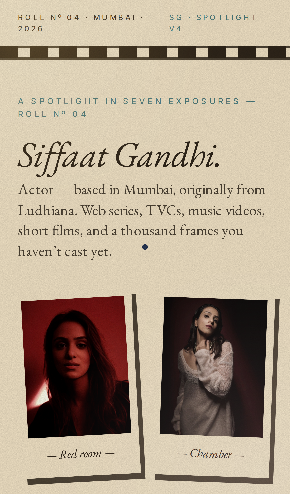
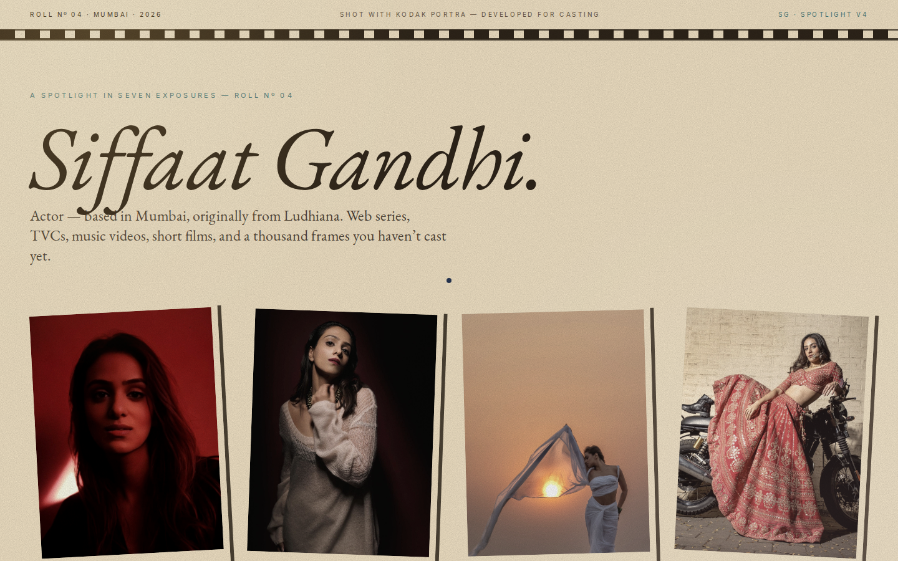

<div align="center">

# SIFFAAT SPOTLIGHT — v4 · VINTAGE ANALOG

### A SPOTLIGHT · Nº 04 · MUMBAI · MMXXVI

*Film-roll edition of [siffaatgandhi.online](https://siffaatgandhi.online/). Faded cream paper, sepia tones, polaroid frames, light leaks, film-grain overlay.*

[](https://github.com/Piyushmishra29/siffat-spotlight/tree/v4-vintage)
[](http://localhost:3000/v4)
[](https://uupm.cc)

</div>

---

## WHAT THIS IS

A portfolio for a screen actor, told as if printed in a photography zine from 1978. Film grain across every pixel, polaroid frames with hand-drawn rotations, hand-set Garamond italics with drop caps, contact information presented as Plates and Exposures.

The most **thematically resonant** of the five — the medium is the message: an actor, shown through the cinematic medium that made her.

Design system generated via [UI/UX Pro Max v2.5](https://github.com/nextlevelbuilder/ui-ux-pro-max-skill) on `2026-05-13`.

> *"Film grain, VHS, cassette tape, polaroid, analog warmth, faded colors, light leaks, vintage photography."*

---

## PREVIEW

<table>
  <tr>
    <td align="center" width="320">
      
      <br/><sub><b>Mobile · Polaroid wall</b></sub>
    </td>
    <td align="center" width="320">
      
      <br/><sub><b>Desktop · Film-strip header + Roll Nº 04</b></sub>
    </td>
  </tr>
</table>

Full-page mobile capture: [`screenshots/v4/mobile-full.png`](screenshots/v4/mobile-full.png)
Full-page desktop capture: [`screenshots/v4/desktop-full.png`](screenshots/v4/desktop-full.png)

---

## DESIGN SYSTEM

| Token | Value | Use |
|---|---|---|
| `v4paper` | `#F5E6C8` | Faded cream paper ground |
| `v4cream` | `#EFDFC0` | Story section ground (slightly darker) |
| `v4sepia` | `#D4A574` | Contact section ground · warm sepia |
| `v4ink` | `#2E2419` | Body type · borders · sprocket holes |
| `v4mute` | `#6B5A48` | Secondary type |
| `v4teal` | `#4A7B7C` | Cool accent (single-use) · drop caps · eyebrows |
| `v4rose` | `#E8B4B8` | Soft pink accent (light leak gradient) |
| `v4leak` | `rgba(255,200,100,0.18)` | Warm light leak gradient |

**Pattern:** Editorial photography zine — Plates · Exposures · Roll Nº.
**Style:** Vintage Analog / Retro Film — `sepia(0.18-0.3) contrast(1.05) saturate(0.85)` on all imagery, SVG turbulence film-grain mix-blend-multiply at 16% opacity, fixed radial light-leak gradients mix-blend-screen, polaroid frames with 1-3° rotation.
**Typography:** **EB Garamond** italic display (existing site font) + **Inter** for tracked uppercase metadata.

### Key effects
- **SVG fractal-noise film grain** fixed across the viewport, mix-blend-multiply at 16% opacity
- **Warm light leak** radial gradient — top-left amber + bottom-right rose, mix-blend-screen, fixed
- **Polaroid frame** — 10px paper border with offset 6×8 hard shadow, 1-3° rotation, snaps to 0° on hover
- **Sprocket-hole strip** at the top of the page — `repeating-linear-gradient` simulating 35mm film perforations
- **Filmstrip dividers** between sections — black band with eyebrow + title + diamond marks + sprocket strip
- **Drop cap** in teal at section openers (huge italic Garamond)

### Anti-patterns (avoid)
- Pure white backgrounds (breaks the paper feel)
- Sans-serif as display type (breaks the typewriter / zine register)
- Grain overlay above 20% opacity (illegible)
- Sharp / glossy treatments — everything should feel touched

---

## SECTIONS (called "Exposures")

| Nº | Section | What it does |
|----|---------|--------------|
| — | Filmstrip header | `ROLL Nº 04 · MUMBAI · 2026` · "SHOT WITH KODAK PORTRA — DEVELOPED FOR CASTING" · `SG · SPOTLIGHT v4` · sprocket-hole strip below |
| Cover | Hero | Italic Garamond name lockup · 4-polaroid wall · sepia-bordered stat ledger |
| I | Filmstrip | "The Filmstrip" — 18 sepia-tinted work cells with subtle 0.6° rotation, italic titles, teal tag chips |
| II | Roll of Faces | 6 polaroid portraits, varied rotations, hard-edged shadows |
| III | Letter | Story section on darker cream ground · italic drop-cap letter from Siffaat + invoice-style spec sheet |
| IV | Tapes | Polaroid-framed tape tiles · sepia-tinted thumbnails · italic captions |
| V | Let's Talk | Sepia-ground contact section · 3 glyph cards (✉ ☎ ◉) · roll-end signoff |

---

## STACK

| Layer | What |
|---|---|
| Framework | Next.js 14 app router · static export |
| Language | TypeScript |
| Styles | Tailwind CSS + custom v4 token extension + inline SVG turbulence filter |
| Fonts | EB Garamond (display, italic-led) + Inter (labels) — both Google Fonts |
| Images | `next/image` with CSS filters `sepia()` + `contrast()` + `saturate()` |
| Motion | CSS hover transforms (rotation snap to 0°) · no JS scroll |
| Host | Hostinger static (when merged) |

Build size: **`/v4` route = 176 B route-specific** (92.8 kB total first-load).

---

## RUN LOCALLY

```bash
git clone git@github.com:Piyushmishra29/siffat-spotlight.git
cd siffat-spotlight
git checkout v4-vintage
npm install
npm run dev      # http://localhost:3000/v4
```

---

## GOOD FOR / NOT FOR

**Good for:** Indie cinema, festival circuit, photography-driven projects, vintage / nostalgia brand campaigns, music videos in throwback registers, anything that wants to **feel** like a piece of physical photography.

**Not for:** Tech brand TVCs (the warm wash works against clean-tech aesthetics). Anything time-pressed — agents skimming on phones may find the texture overload. Pure professionalism — this is intentionally hand-made and a little slow.

---

## ACCESSIBILITY NOTES

- Film grain overlay can interact with low-contrast text — verify with WCAG AA contrast checker before locking copy
- `prefers-reduced-motion` is **not** strictly required here (no motion) but the polaroid rotations should still respect it in future iterations
- The SVG turbulence filter is GPU-cheap but may be visually noisy for users with vestibular sensitivities — consider adding a "calm mode" toggle if rolled out

---

## MERGE INTO MAIN

```bash
git checkout main
git merge v4-vintage
git push origin main
```

Hostinger auto-deploys `main` to [siffaatgandhi.online](https://siffaatgandhi.online/) within a minute. `/v4` will be live alongside the current home page.

---

<div align="center">

### v4 — END OF ROLL.

*One of five design directions explored for the 2026 spotlight.*
*See also: [v2 brutalist](https://github.com/Piyushmishra29/siffat-spotlight/tree/v2-brutalist) · [v3 cinema](https://github.com/Piyushmishra29/siffat-spotlight/tree/v3-cinema) · [v5 couture](https://github.com/Piyushmishra29/siffat-spotlight/tree/v5-couture) · [v6 exaggerated](https://github.com/Piyushmishra29/siffat-spotlight/tree/v6-exaggerated)*

</div>
