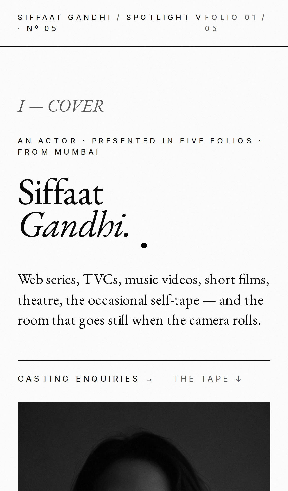
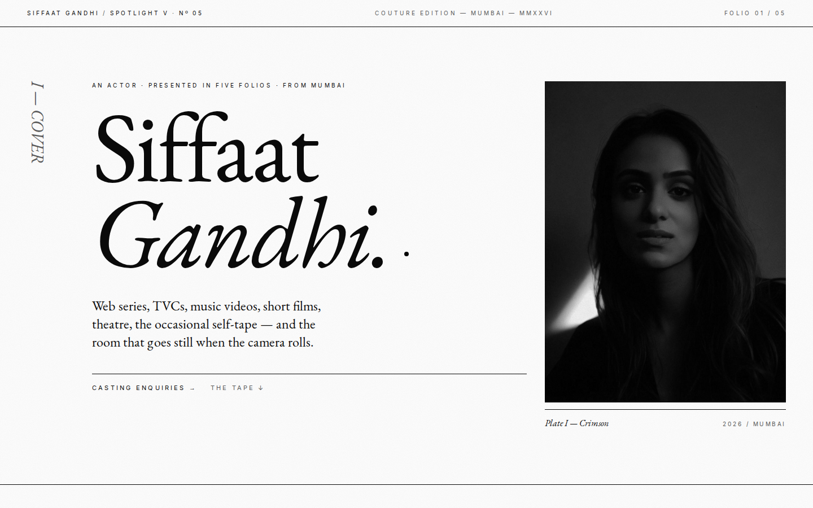

<div align="center">

# SIFFAAT SPOTLIGHT — v5 · COUTURE MONOCHROME

### A SPOTLIGHT · Nº 05 · MUMBAI · MMXXVI

*Pure monochrome couture edition of [siffaatgandhi.online](https://siffaatgandhi.online/). White ground, oversized EB Garamond italics, asymmetric 12-col grid, zero radius, no colour.*

[](https://github.com/Piyushmishra29/siffat-spotlight/tree/v5-couture)
[](http://localhost:3000/v5)
[](https://uupm.cc)

</div>

---

## WHAT THIS IS

A spotlight presented like a **Phaidon monograph or Saint Laurent lookbook**. Pure white paper, ink-black type, no third colour anywhere. Every section is a "Folio" with a Roman numeral; every photograph is a "Plate." Photography is rendered grayscale to enforce the discipline.

The quiet, reverent, museum-grade option. Casting directors who collect Pirelli calendars and exhibition catalogues live here.

Design system generated via [UI/UX Pro Max v2.5](https://github.com/nextlevelbuilder/ui-ux-pro-max-skill) on `2026-05-13`.

> *"Monochrome, black white, editorial, austere, typographic, sharp, zero radius, high contrast, brutalist, pocket editorial, serif, mechanical."*

---

## PREVIEW

<table>
  <tr>
    <td align="center" width="320">
      
      <br/><sub><b>Mobile · Folio I cover</b></sub>
    </td>
    <td align="center" width="320">
      
      <br/><sub><b>Desktop · Asymmetric 12-col cover</b></sub>
    </td>
  </tr>
</table>

Full-page mobile capture: [`screenshots/v5/mobile-full.png`](screenshots/v5/mobile-full.png)
Full-page desktop capture: [`screenshots/v5/desktop-full.png`](screenshots/v5/desktop-full.png)

---

## DESIGN SYSTEM

| Token | Value | Use |
|---|---|---|
| `v5bg` | `#FFFFFF` | Page ground · pure paper |
| `v5ink` | `#0A0A0A` | All type · all rules · everything |
| `v5mute` | `#5C5C5C` | Tertiary metadata only |
| `v5line` | `#D7D7D7` | Dotted/dashed dividers in spec sheet |
| `v5wash` | `#F5F5F5` | Card placeholder background only |

**Pattern:** Editorial book / monograph — Folios I through V.
**Style:** Minimalist Monochrome / Couture — pure black-white, 0px radius, single hairline 1px ink rules between sections, oversized italic serif display, asymmetric column spans on photo plates.
**Typography:** **EB Garamond** (display, italic + roman) + **Inter** for tracked uppercase metadata. Italic is used for the *subordinate* clause of every headline ("Siffaat / *Gandhi.*", "One actor, / *six plates.*").

### Key effects
- **All photography grayscale** via Tailwind `grayscale` utility (CSS filter `grayscale(100%)`)
- **Asymmetric 12-col grid** for the Portrait Index — 7/5/6/6/5/7 column spans alternating
- **Folio numerals** (I–V) in Roman, the vertical-mode column eyebrow on desktop cover
- **Plate captions** under every photo — italic name + tracked-uppercase year on baseline-aligned hairline
- **Hairline rule breaks** (1px ink) between sections — no shadows, no fades, no decoration
- **Couture-invoice header** — three-up tracked uppercase strip across the top

### Anti-patterns (avoid)
- Any third colour anywhere
- Coloured photography (grayscale enforced)
- Border radius — must be 0 throughout
- Bold italic in body (italic is for hierarchy, weight is for emphasis)

---

## SECTIONS (called "Folios")

| Nº | Section | What it does |
|----|---------|--------------|
| Header | Couture invoice strip | Three-up tracked uppercase: `SIFFAAT GANDHI / SPOTLIGHT V · Nº 05` · `COUTURE EDITION` · `FOLIO 01 / 05` |
| I | Cover | 12-col grid · vertical "I — COVER" numeral · 11vw name lockup · single plate (Plate I — Crimson) |
| II | Work · Select Reel | 18-tile work plate index — each plate has italic title with `№NN` prefix + tracked tag |
| III | Range · Portrait Index | 6-plate asymmetric grid · italic plate names (Plate I–VI) · years in tracked Roman |
| IV | Story · Letter from Ludhiana | Big drop-cap italic letter + invoice-style spec sheet (8 rows: From · Based · Since · Tongue · Practice · Stature · Trained at · Mentor) |
| V | Tape · The Archive | 6-tape grid · italic captions · grayscale tape thumbnails |
| Colophon | Contact (inverted) | Black ground / white type · "Write, *or call.*" · 3 underlined contact rows |

---

## STACK

| Layer | What |
|---|---|
| Framework | Next.js 14 app router · static export |
| Language | TypeScript |
| Styles | Tailwind CSS + custom v5 token extension · Tailwind `grayscale` utility on all imagery |
| Fonts | EB Garamond (display, italic-led) + Inter (labels) — both Google Fonts |
| Images | `next/image` with `grayscale` CSS filter |
| Motion | Minimal — `hover:scale-[1.02]` on plates only · no scroll-driven motion |
| Host | Hostinger static (when merged) |

Build size: **`/v5` route = 175 B route-specific** (92.8 kB total first-load).

---

## RUN LOCALLY

```bash
git clone git@github.com:Piyushmishra29/siffat-spotlight.git
cd siffat-spotlight
git checkout v5-couture
npm install
npm run dev      # http://localhost:3000/v5
```

---

## GOOD FOR / NOT FOR

**Good for:** Festival circuit (Berlin, Venice, Toronto). High fashion / couture brand TVCs (Saint Laurent, Margiela, Lemaire). Magazine editorials (Numéro, Self Service, Re-Edition). Anyone selling "art" over "entertainment." Print-leaning art directors.

**Not for:** Family-coded TVCs (Maggi, Vivo Diwali) — the austerity reads cold. Reality / mass-OTT — needs more colour heat. Anything where personality must come through before craft.

---

## TYPOGRAPHIC DISCIPLINE

This variant lives or dies on type. Key rules:

- Display caps in **EB Garamond Regular** (NOT bold) at `clamp(2.5rem, 8vw, 7rem)`
- Subordinate clause is **EB Garamond Italic Light** at the same size — the contrast in weight + slant carries the rhythm
- Metadata in **Inter at 10px uppercase, tracking 0.25-0.3em** — this is the entire micro-typographic language
- Body in **EB Garamond Regular** at `text-2xl md:text-3xl, line-height 1.5`
- **No bold body type. No italic metadata.** Discipline is the design.

---

## MERGE INTO MAIN

```bash
git checkout main
git merge v5-couture
git push origin main
```

Hostinger auto-deploys `main` to [siffaatgandhi.online](https://siffaatgandhi.online/) within a minute. `/v5` will be live alongside the current home page.

---

<div align="center">

### v5 — END OF FOLIO.

*One of five design directions explored for the 2026 spotlight.*
*See also: [v2 brutalist](https://github.com/Piyushmishra29/siffat-spotlight/tree/v2-brutalist) · [v3 cinema](https://github.com/Piyushmishra29/siffat-spotlight/tree/v3-cinema) · [v4 vintage](https://github.com/Piyushmishra29/siffat-spotlight/tree/v4-vintage) · [v6 exaggerated](https://github.com/Piyushmishra29/siffat-spotlight/tree/v6-exaggerated)*

</div>
