<div align="center">

# SIFFAT, BY SIFFAT, FOR SIFFAT.

### A SPOTLIGHT · Nº 01 · MUMBAI · MMXXVI

*A long-scroll editorial site for actor & model **Siffat Gandhi**.*
*Built like a magazine. Lives on the web.*

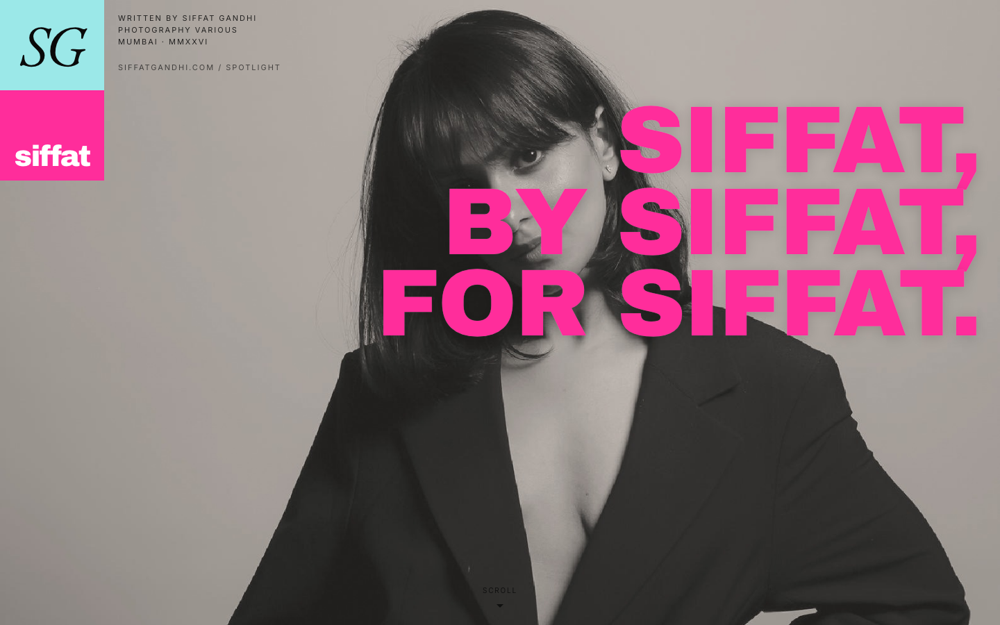

[](https://nextjs.org/)
[](https://www.typescriptlang.org/)
[](https://tailwindcss.com/)
[](#deploy)

</div>

---

## INTRO.

This is the source for [**siffatgandhi.com**](https://siffatgandhi.com) — a single-page, scroll-driven, magazine-style spotlight for **Siffat Gandhi**, a Mumbai-based actor, model, and producer of her own short films.

The reference is i-D Magazine's *Spotlight* series: editorial typography, full-bleed photography, hand-drawn stickers, bold colour blocks, and the kind of pacing you only get from a print designer.

> *"Presence in every frame. Versatility in every look."*

---

## THE SCROLL.

A 17-section single-page narrative. Each scene is its own component, dropped into `app/page.tsx` in order.

### Nº 01 — Cover


Full-bleed cover-suit portrait. Massive pink display caps hanging off the right edge. Sticky **SG/siffat** colour block badge top-left. Credit stack top-right like the masthead of a magazine.

### Nº 02 — Opening Quote

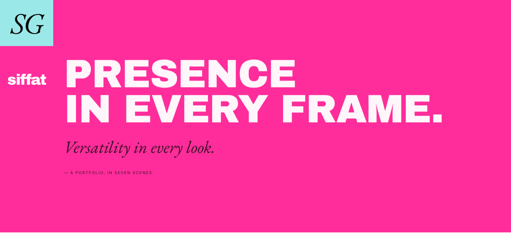

Hot-pink full-bleed block. *"Presence in every frame. Versatility in every look."* — the line that anchors the whole portfolio.

### Nº 03 — The Story

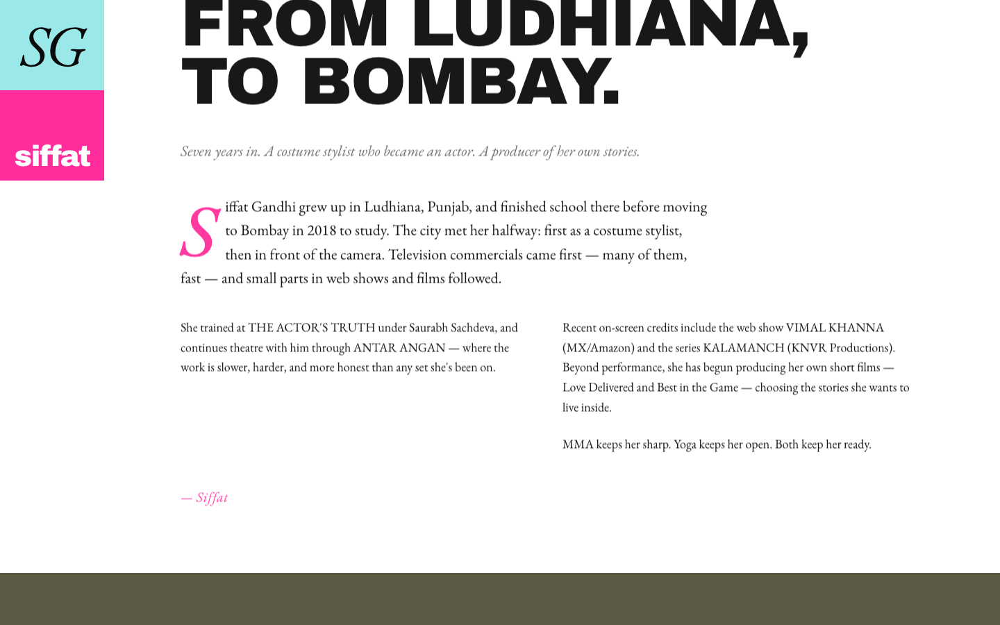

From Ludhiana to Bombay. Drop-cap *S* in oxblood. Single-column intro, then a 2-column body. Italics in EB Garamond. Signed off — Siffat.

### Nº 04 — Photo Trio

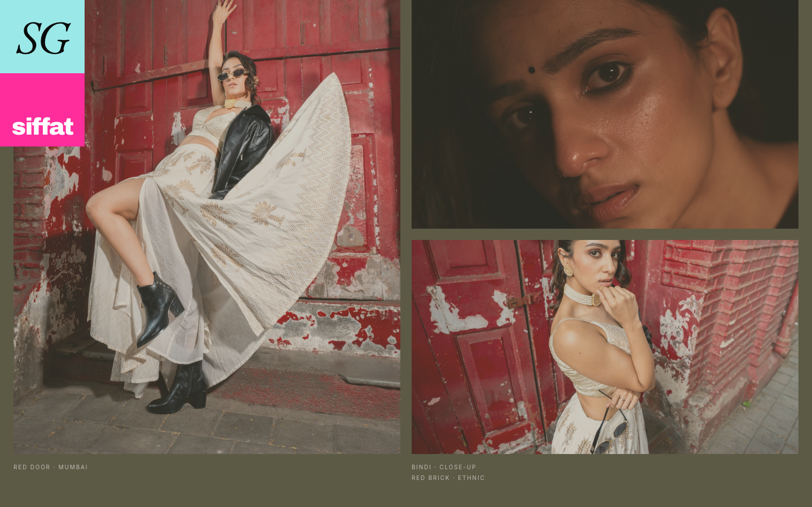

Three frames in olive: *Red Door · Bindi · Red Brick.* Captions tracked in mono caps.

### Nº 05 — On Screen, In Series

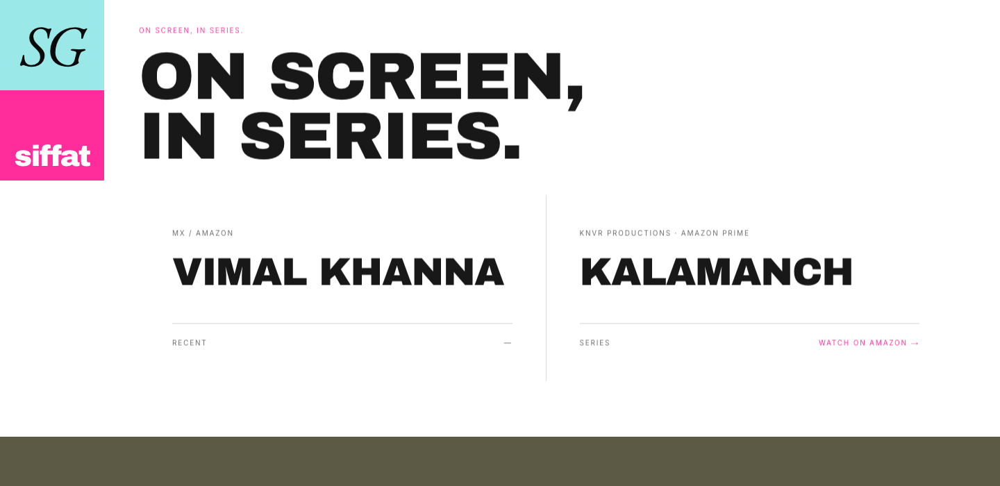

Two web-series cards side by side — **Vimal Khanna** (MX/Amazon) and **Kalamanch** (KNVR Productions, Amazon Prime). Hover-pink wash.

### Nº 06 — The Pyramid

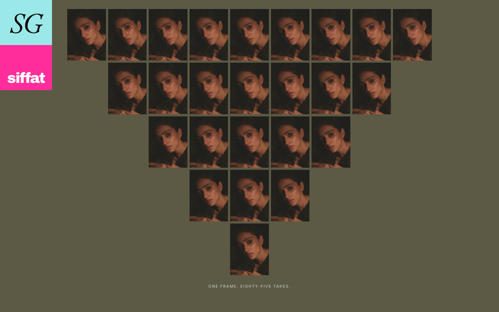

A stacked grid of repeating frames — *"One frame. Eighty-five takes."* — over an olive ground. Pure typographic theatre.

### Nº 07 — In Motion

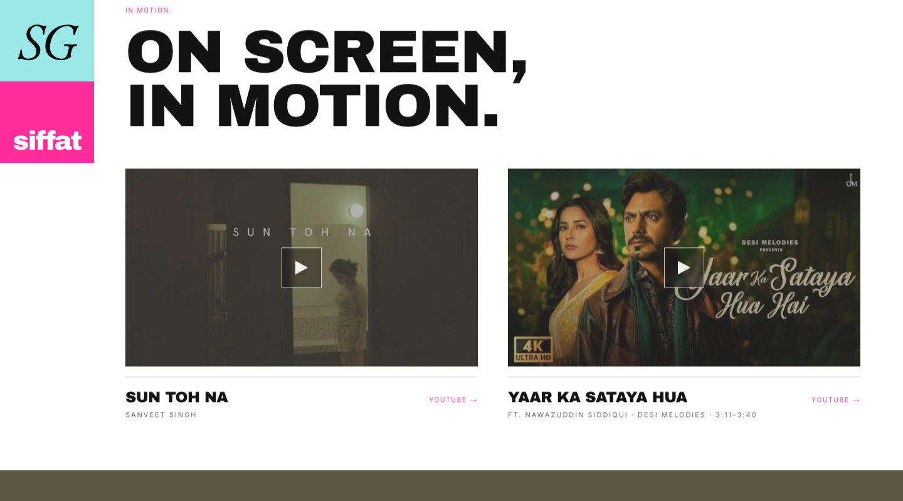

Two music-video cards. Lite-YouTube facade — no iframe until clicked, so the page stays fast.

### Nº 08 — Training

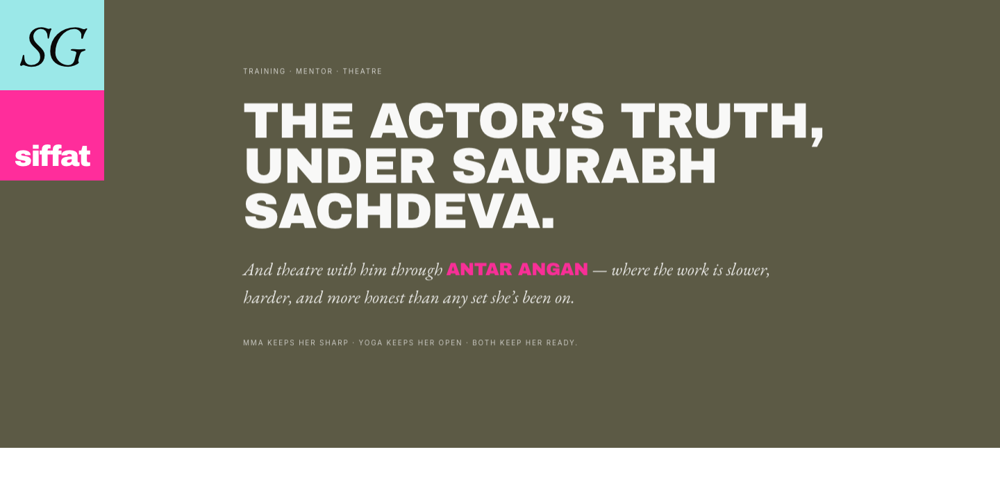

Full-bleed olive section: **THE ACTOR'S TRUTH, under Saurabh Sachdeva.** Plus *Antar Angan* theatre in pink. MMA · Yoga · Both.

### Nº 09 — TVCs & Campaigns

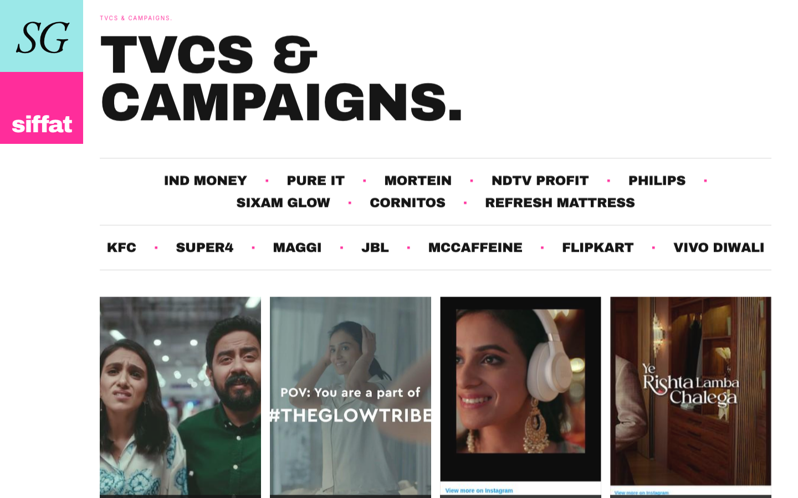

15 brand wordmarks in tracked display caps, then a 4-up grid of campaign stills.

### Nº 10 — The Tape

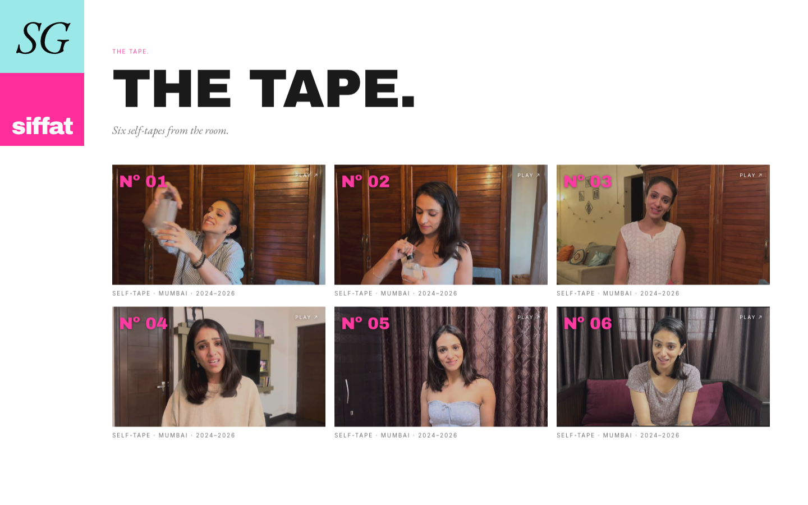

Six audition self-tapes in a 3×2 grid. YouTube thumbnails auto-fetched, click-out to full video.

### Nº 11 — Range

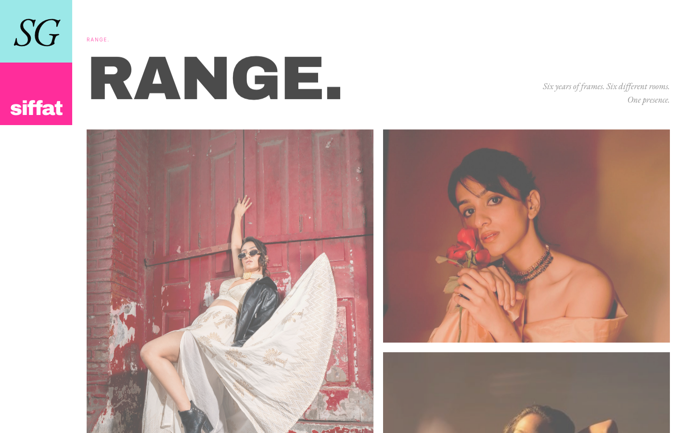

Two-column masonry of editorial portraits. Six years of frames, six different rooms, one presence.

### Nº 12 — Stickers From The Room

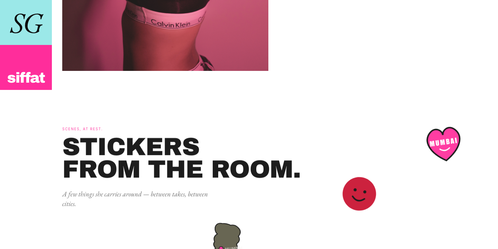

Five hand-drawn SVG stickers — *Bindi · Chai Cup · Clapperboard · Mumbai Heart · India Map* — scattered with wiggle-on-hover animations. The most Indian thing on the page.

### Nº 13 — Let's Work

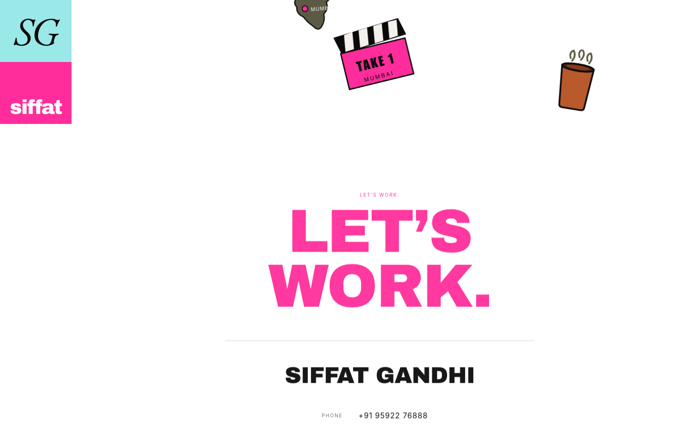

Massive pink *LET'S WORK* lockup. Phone · email · IG. *Based in Mumbai · Available worldwide.*

### Nº 14 — FIN.

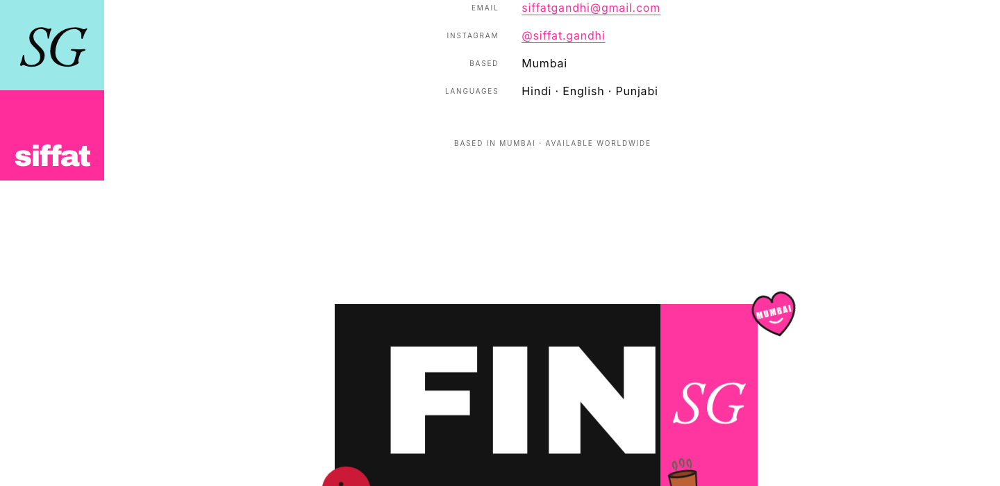

The closing button. Big. Loud. *FIN.*

---

## ON THE PHONE.

The same scroll, redesigned for a 390pt viewport.

<div align="center">

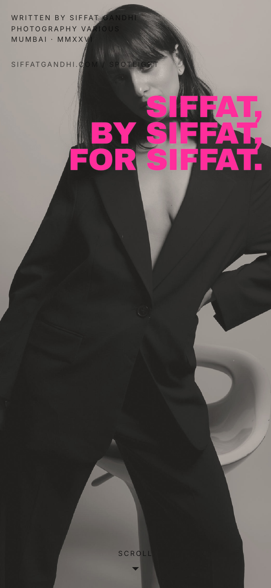
&nbsp;

&nbsp;
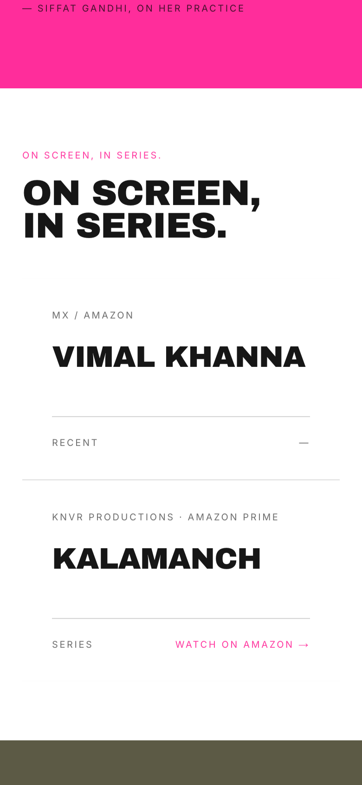

</div>

---

## STACK.

| Layer | What |
|---|---|
| Framework | **Next.js 14** (app router, static export) |
| Language | **TypeScript** |
| Styles | **Tailwind CSS** + custom `@font-face` |
| Display type | **Archivo Black** (Google Fonts) |
| Body type | **EB Garamond** (Google Fonts) |
| Mono / labels | **Inter** (Google Fonts) |
| Images | `next/image` with `unoptimized: true` (static export) |
| Motion | CSS keyframes + `IntersectionObserver`, no animation lib |
| Embeds | Custom **lite-youtube** facade |
| Host | **Hostinger** shared hosting via FTP |
| Output | `out/` — pure HTML/CSS/JS, no server |

No CMS. No analytics. No tracker. No JS framework for animations. The whole page is **under 1 MB before images**.

---

## PALETTE.

```
#F4F1EC   Paper      cream ground, matches the PDF portfolio
#0A0A0A   Ink        body type, base black
#FF2D9B   Pink       the spotlight colour
#FFD9EC   Pink Soft  hover wash on cards
#5C5A45   Olive      full-bleed editorial blocks
#8A857E   Warm Grey  captions, supporting type
#9BE5DD   Cyan       SG block badge accent
```

---

## STRUCTURE.

```
siffat-spotlight/
├── app/
│   ├── page.tsx                 # Orchestrates 18 sections
│   ├── layout.tsx               # Font loading, metadata, OG
│   ├── globals.css              # Tailwind + @font-face + fade-in
│   └── components/
│       ├── SGBlock.tsx          # Sticky colour-block badge
│       ├── Hero.tsx             # Cover + display caps
│       ├── PinkBlockQuote.tsx   # Reusable full-bleed pink quote
│       ├── Story.tsx            # Bio with drop cap
│       ├── PhotoTrio.tsx        # 3-photo olive band
│       ├── OnScreen.tsx         # Web series cards
│       ├── PhotoPyramid.tsx     # Repeating frames grid
│       ├── MusicVideos.tsx      # Lite-YouTube tiles
│       ├── OliveSection.tsx     # Training callout
│       ├── BrandWork.tsx        # TVCs wordmarks + grid
│       ├── ShortFilms.tsx       # Produced shorts
│       ├── AuditionReels.tsx    # Tape grid
│       ├── Gallery.tsx          # Masonry of portraits
│       ├── StickersScatter.tsx  # Wiggle stickers
│       ├── Contact.tsx          # Let's work
│       ├── Fin.tsx              # Closing button
│       ├── Footer.tsx           # Tiny tracked caps
│       ├── LiteYouTube.tsx      # YouTube facade
│       └── stickers/            # SVG sticker components
├── lib/
│   ├── content.ts               # Typed Siffat bio + credits
│   └── useFadeIn.ts             # IntersectionObserver hook
├── public/
│   ├── photos/                  # Warm-graded portraits
│   └── fonts/                   # (currently using Google Fonts)
├── screenshots/                 # Build artefacts + README assets
├── next.config.mjs              # Static export config
└── tailwind.config.ts           # Custom palette + display font
```

---

## RUN LOCALLY.

```bash
git clone git@github.com:Piyushmishra29/siffat-spotlight.git
cd siffat-spotlight
npm install
npm run dev
```

Open [http://localhost:3000](http://localhost:3000).

---

## BUILD.

```bash
npm run build
```

Outputs static HTML to `out/`. Drop it onto any static host.

---

## DEPLOY.

Hostinger shared hosting via FTP.

```bash
npm run build
# Upload contents of out/ to public_html on the FTP host.
```

The site is **fully static** — no Node, no PHP, no database. Once `out/` is on the server, it's live.

---

## CREDITS.

| Role | Name |
|---|---|
| Subject | [Siffat Gandhi](https://instagram.com/siffat.gandhi) |
| Photography | Various |
| Design reference | i-D Magazine *Spotlight* series |
| Type | Archivo Black · EB Garamond · Inter |
| Place | Mumbai |
| Year | MMXXVI |

---

<div align="center">

### FIN.

*A SIFFAT GANDHI SPOTLIGHT · MUMBAI · MMXXVI*

</div>
