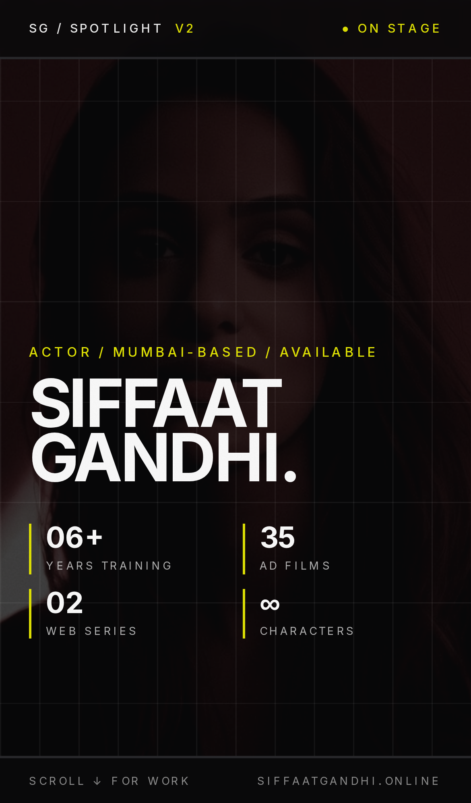
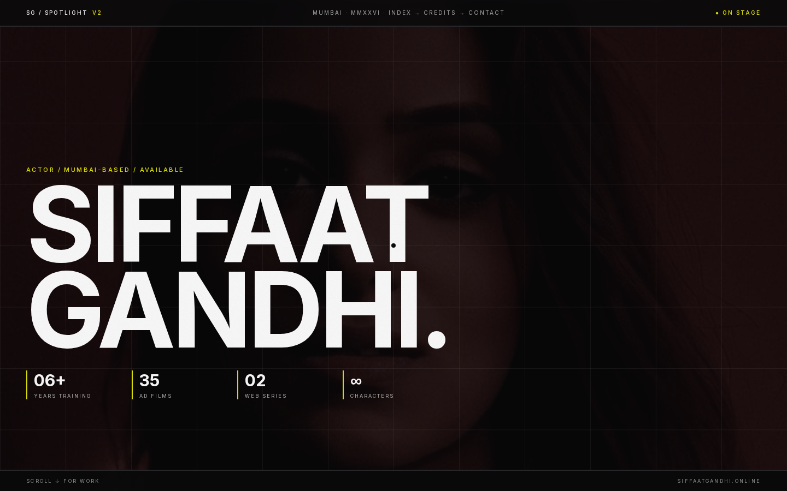

<div align="center">

# SIFFAAT SPOTLIGHT — v2 · KINETIC BRUTALISM

### A SPOTLIGHT · Nº 02 · MUMBAI · MMXXVI

*Brutalist edition of [siffaatgandhi.online](https://siffaatgandhi.online/). Black ground, acid yellow flood, Inter mono-family, zero radius.*

[](https://github.com/Piyushmishra29/siffat-spotlight/tree/v2-brutalist)
[](http://localhost:3000/v2)
[](https://uupm.cc)

</div>

---

## WHAT THIS IS

The same Siffaat Gandhi content rendered through a **Kinetic Brutalism** design system. Loud, aggressive, scroll-driven. Designed for the version of casting that prefers a wall-shaking visual signature over a quiet portfolio.

Design system generated via [UI/UX Pro Max v2.5](https://github.com/nextlevelbuilder/ui-ux-pro-max-skill) on `2026-05-13`.

> *"Visuals first. Filter by category. Fast loading essential. Tap any tile to play."*

---

## PREVIEW

<table>
  <tr>
    <td align="center" width="320">
      
      <br/><sub><b>Mobile · Hero + masonry</b></sub>
    </td>
    <td align="center" width="320">
      
      <br/><sub><b>Desktop · Hero</b></sub>
    </td>
  </tr>
</table>

Full-page mobile capture: [`screenshots/v2/mobile-full.png`](screenshots/v2/mobile-full.png)
Full-page desktop capture: [`screenshots/v2/desktop-full.png`](screenshots/v2/desktop-full.png)

---

## DESIGN SYSTEM

| Token | Value | Use |
|---|---|---|
| `v2bg` | `#0A0A0B` | Page ground · near-black, not pure |
| `v2fg` | `#FAFAFA` | Primary text |
| `v2ink` | `#18181B` | Surface cards |
| `v2muted` | `#3F3F46` | Secondary text |
| `v2border` | `#27272A` | 2px hairlines |
| `v2acid` | `#DFE104` | Flood-inversion accent · CTA · status dots |
| `v2blue` | `#2563EB` | Contact section ground · alternate accent |

**Pattern:** Portfolio Grid (Masonry) with category filter.
**Style:** Kinetic Brutalism — 0px radius, 2px borders, 100ms color transitions, scroll-driven motion, uppercase, oversized typography.
**Typography:** **Inter** single family across weights 300→900. No serif. The mono-family discipline is the brutalist move.

### Key effects
- **Flood inversion** on tile press — every card label inverts to acid yellow ground + black text on hover
- **Infinite marquee** strips between sections (acid · ink · blue grounds, alternating)
- **2px borders** on everything; never radius
- **100ms** color transitions only — no easing curves, intentionally abrupt
- **8.333% × 12.5% grid** decoration on the hero (12-column × 8-row print-grid hairlines)

### Anti-patterns (avoid)
- Boring design · Hidden work
- Soft radii, gradients, "elegant" treatments
- Mixing serif faces — Inter only

---

## SECTIONS

| Nº | Section | What it does |
|----|---------|--------------|
| — | Top meta strip | `SG / SPOTLIGHT v2` · location · "● ON STAGE" status dot |
| Hero | `V2Hero` | Full-bleed darkened red portrait, SIFFAAT GANDHI lockup, 4-stat ledger (years training · ad films · web series · characters) |
| — | `V2Marquee` (acid) | Infinite-loop tagline strip on acid yellow ground |
| 01 | `V2PortfolioGrid` | 18-tile masonry — Web Series + TVCs + Music Videos + Short Films — **filter chips** (ALL · SERIES · TVC · MUSIC · FILM) |
| — | `V2Marquee` (ink) | Category list strip |
| 02 | `V2PhotoStrip` | 5-frame horizontal snap-scroll editorial |
| 03 | `V2Philosophy` | **Acid yellow page** · manifesto + spec sheet (hometown · height · languages · skills · training · theatre) |
| 04 | `V2Tape` | 6 self-tape tiles · cinematic studio posters · autoplay-in-view via `AutoplayTape` |
| — | `V2Marquee` (blue) | Availability strip |
| 05 | `V2Contact` | **Cobalt blue page** · LET'S WORK TOGETHER · 3 contact cards + FIN slab + back-to-v1 link |

---

## STACK

| Layer | What |
|---|---|
| Framework | Next.js 14 app router · static export |
| Language | TypeScript |
| Styles | Tailwind CSS + custom v2 token extension |
| Fonts | Inter (Google Fonts) — weights 300, 400, 500, 600, 700, 800, 900 |
| Images | `next/image` for posters, `` for hero |
| Motion | CSS keyframes + `useScrollProgress` from main app · no animation lib |
| Tapes | `AutoplayTape` reused from main app (in-view muted loop) |
| Host | Hostinger static (when merged) |

Build size: **`/v2` route = 12.2 kB first-load JS** (105 kB total).

---

## RUN LOCALLY

```bash
git clone git@github.com:Piyushmishra29/siffat-spotlight.git
cd siffat-spotlight
git checkout v2-brutalist
npm install
npm run dev      # http://localhost:3000/v2
```

To preview alongside the other variants on one server, see the `preview-all` workflow in the [main README](https://github.com/Piyushmishra29/siffat-spotlight/blob/main/README.md).

---

## GOOD FOR / NOT FOR

**Good for:** Underground / music / culture-aware projects. Tape-house casting. Editorial direction with a personality. Audiences that respond to "loud" and "memorable."

**Not for:** Family-brand TVC pitches that need quiet professionalism. Anything that benefits from soft and approachable. Audiences that scan-read fast — the brutalist density needs time on the page.

---

## MERGE INTO MAIN

If this becomes the chosen direction:

```bash
git checkout main
git merge v2-brutalist
git push origin main
```

Hostinger auto-deploys `main` to [siffaatgandhi.online](https://siffaatgandhi.online/) within a minute. The `/v2` route will be live alongside the current home page (which stays at `/`).

If you instead want v2 to **replace** the home, that's a separate small task (move `app/v2/page.tsx` → `app/page.tsx`).

---

<div align="center">

### v2 — END.

*One of five design directions explored for the 2026 spotlight.*
*See also: [v3 cinema](https://github.com/Piyushmishra29/siffat-spotlight/tree/v3-cinema) · [v4 vintage](https://github.com/Piyushmishra29/siffat-spotlight/tree/v4-vintage) · [v5 couture](https://github.com/Piyushmishra29/siffat-spotlight/tree/v5-couture) · [v6 exaggerated](https://github.com/Piyushmishra29/siffat-spotlight/tree/v6-exaggerated)*

</div>
